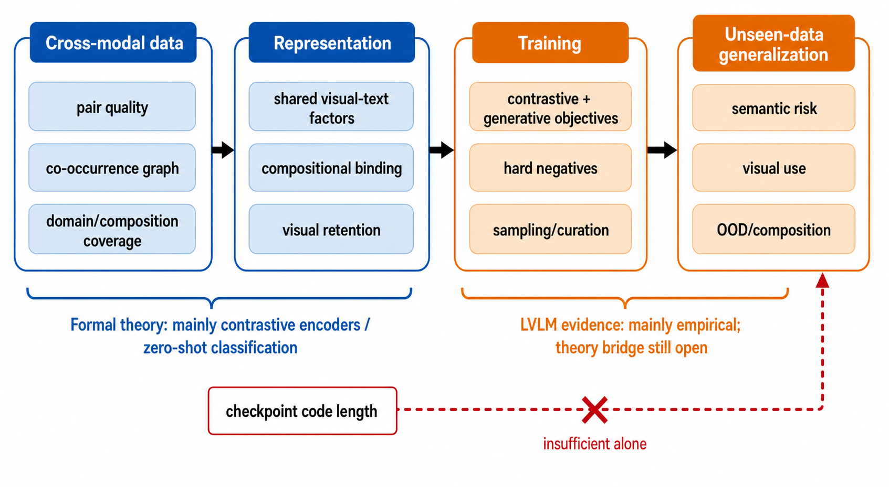

# VLM 泛化机制文献地图（2026-08-07）

## 1. 核心结论

文献支持一个比“找更小复杂度项”更有科学内容的分层框架：

> 跨模态数据关系决定可学信号，表示与训练决定这些关系是否被保留，最终才影响
> 未见数据上的语义风险、视觉利用和组合/OOD 泛化。

但目前存在明确理论断层：严格结果集中在 CLIP 式对比表示和零样本分类，生成式
LVLM 的视觉条件 next-token 风险尚无可直接套用的同等桥梁。因此以下机制只能按
证据等级使用，不能把 CLIP 定理宣布为 MiniMind-V 定理。

## 2. 数据侧

### 2.1 配对质量与跨模态共现结构

- Zhang et al. 将 multi-modal spectral contrastive loss 等价为图文共现矩阵的低秩
  非对称分解，并在有限图文集合、谱损失、双编码器和下游线性 probe 设定中证明：
  配对标签不一致项与共现图谱性质进入误差上界
  （`FORMAL_THEORY`，[arXiv:2306.04272](https://doi.org/10.48550/arXiv.2306.04272)）。
  该定理不能直接认证 InfoNCE 训练的生成式 LVLM，但它提供了目前最直接的
  “配对质量/共现结构 → 下游泛化”桥梁。
- DataComp 在固定训练代码与算力下只改变数据过滤，并在 38 个下游数据集上展示
  数据策展能够显著改变 CLIP 迁移性能
  （`ALGORITHMIC_EVIDENCE`，[arXiv:2304.14108](https://doi.org/10.48550/arXiv.2304.14108)）。
- Data Filtering Networks 学习数据过滤器并在 DataComp 设定中验证可扩展过滤
  （`ALGORITHMIC_EVIDENCE`，[arXiv:2309.17425](https://doi.org/10.48550/arXiv.2309.17425)）。
- BLIP 的 captioner + filter 在 noisy web pairs 上同时改善理解和生成任务，并报告
  零样本 video-language 迁移
  （`ALGORITHMIC_EVIDENCE`，[arXiv:2201.12086](https://doi.org/10.48550/arXiv.2201.12086)）。

**判断**：这是形式桥梁最强的数据方向。它解释了为何 checkpoint 码长不是充分量：
同样或更短的模型编码并不决定训练图文关系的语义一致性、图连接性，也不保证模型
保留这些谱方向。缺口是：当前 P/S 在同预算下共享数据分布，纯数据侧的量本身不能
解释同数据的结构排序，必须进一步研究“模型保留了多少任务相关共现结构”。

### 2.2 域与组合覆盖

- Kempf et al. 在受控 DomainNet 图文混合中发现 domain diversity 通常改善 domain
  与 compositional generalization，但不同域的边际贡献依赖已存在的域组合，且部分域
  仍会失败（`EMPIRICAL_MECHANISM`，
  [arXiv:2502.09507](https://doi.org/10.48550/arXiv.2502.09507)）。
- MM1 的受控预训练研究表明数据 mixture 和规模是性能的重要决定因素，而 connector
  设计的边际影响相对较小（`EMPIRICAL_MECHANISM`，
  [arXiv:2403.09611](https://doi.org/10.48550/arXiv.2403.09611)）。
- 视觉指令数据存在显著冗余；TIVE 报告约 15% 选择数据可匹配完整数据的多项结果，
  但它属于影响函数驱动的经验算法证据，尚非一般 VLM 定理
  （`ALGORITHMIC_EVIDENCE`，
  [arXiv:2403.09559](https://doi.org/10.48550/arXiv.2403.09559)）。

**判断**：覆盖结构有训练算法出口，但需要控制数据混合的重新训练才能验证；现有
同数据 P/S artifact 不足以作独立检验。

## 3. 模型 / 表示侧

### 3.1 跨模态组合绑定与语言捷径

- Winoground 用词集合相同、组合关系不同的图文对测试 visio-linguistic
  compositionality，早期主流模型接近随机
  （`EMPIRICAL_MECHANISM`，
  [CVPR 2022](https://doi.org/10.1109/CVPR52688.2022.00517)）。
- ARO 发现检索评估和对比训练可由 bag-of-words / order-insensitive shortcut 完成；
  composition-aware hard negatives 能改善关系和顺序任务
  （`EMPIRICAL_MECHANISM + ALGORITHMIC_EVIDENCE`，
  [arXiv:2210.01936](https://doi.org/10.48550/arXiv.2210.01936)）。
- SugarCrepe 证明部分旧 hard-negative benchmark 可被文本分布偏差破解，并用人工
  核查负例重新评估；训练/测试 hard-negative 类型匹配时的收益不能等同为一般组合
  能力（`EMPIRICAL_MECHANISM`，
  [arXiv:2306.14610](https://doi.org/10.48550/arXiv.2306.14610)）。

**判断**：组合绑定可以解释“码长更短但性能更差”：参数共享/压缩可能保留对象和
词的边际信息，却损害图文关系绑定。它有明确可失败测试和 hard-negative 训练出口，
但现有理论主要是 CLIP 检索，不是生成式 LVLM 风险界。

### 3.2 视觉表示保持与视觉条件依赖

- Eyes Wide Shut 构造 CLIP-blind image pairs，发现多个 MLLM 的错误与 CLIP 视觉
  表示盲点相关；加入 self-supervised visual features 改善视觉 grounding
  （`EMPIRICAL_MECHANISM + ALGORITHMIC_EVIDENCE`，
  [CVPR 2024](https://doi.org/10.1109/CVPR52733.2024.00914)）。
- MMStar 明确筛除不需要图像或疑似泄漏的题目，并显示很多常用 benchmark 可由
  language-only 输入获得非平凡分数
  （`EMPIRICAL_MECHANISM`，
  [arXiv:2403.20330](https://doi.org/10.48550/arXiv.2403.20330)）。
- POPE 发现视觉指令中高频/共现对象更容易被 LVLM 幻觉，并提出较稳定的对象轮询
  评估（`EMPIRICAL_MECHANISM`，
  [EMNLP 2023](https://doi.org/10.18653/v1/2023.emnlp-main.20)）。
- Visual Contrastive Decoding 通过对比原图与失真图输出分布降低 object
  hallucination，提供 training-free 算法证据
  （`ALGORITHMIC_EVIDENCE`，
  [CVPR 2024](https://doi.org/10.1109/CVPR52733.2024.01316)）。

**判断**：视觉条件依赖是生成式 LVLM 最直接的特有机制，但当前证据主要是实证。
正确图像与错配/失真图像的性能差只能称为操作性代理，不能称互信息或正式视觉风险。
如果没有新的理论桥梁，不得把它退化成“再试一个视觉 proxy”。

### 3.3 Modality gap 与 modality bias

- Modality gap 的工作同时给出几何解释与下游实证，并显示 gap 距离的改变会影响
  zero-shot performance/fairness
  （`EMPIRICAL_MECHANISM`，
  [arXiv:2203.02053](https://doi.org/10.48550/arXiv.2203.02053)）。
- Modality bias 在多模态分类/VQA OOD 数据上与单模态虚假相关有关，并可由
  plug-and-play loss 缓解
  （`ALGORITHMIC_EVIDENCE`，[TOMM](https://doi.org/10.1145/3565266)）。

**筛除结论**：原始 modality-gap 距离不是单调的泛化量，任务和表示几何依赖强；
通用 modality-bias 分类结论也不能直接解释自回归 LVLM。因此两者作为背景机制保留，
不单独登记为今晚主 candidate。

## 4. 训练侧

### 4.1 Contrastive 与 generative supervision 的互补

- CoCa 在同一 encoder-decoder 图中联合 contrastive 与 captioning loss；目标消融
  显示单一目标分别偏向不同任务，联合目标覆盖分类、检索、VQA 与 captioning
  （`ALGORITHMIC_EVIDENCE`，
  [arXiv:2205.01917](https://doi.org/10.48550/arXiv.2205.01917)）。
- SigLIP 将全局 softmax contrastive loss 改为 pairwise sigmoid loss，并报告 batch
  efficiency 与 noise robustness；对象仍是 image-text pretraining/zero-shot transfer，
  不是生成式 LVLM 泛化定理
  （`ALGORITHMIC_EVIDENCE`，
  [ICCV 2023](https://doi.org/10.1109/ICCV51070.2023.01100)）。
- Prismatic 在统一评估下比较视觉 backbone、数据与优化设计，并指出视觉表示选择
  显著影响多项 VLM 能力；其主训练目标仍是 next-token prediction
  （`EMPIRICAL_MECHANISM`，
  [arXiv:2402.07865](https://doi.org/10.48550/arXiv.2402.07865)）。
- LLaVA-1.5 的受控实验显示强视觉 encoder、MLP connector 与任务数据可显著改善
  11 个 benchmark；它是设计证据，不是复杂度—泛化定理
  （`ALGORITHMIC_EVIDENCE`，
  [CVPR 2024](https://doi.org/10.1109/CVPR52733.2024.02484)）。

**判断**：next-token supervision 可能不足以强制保留视觉关系，联合/辅助目标有自然
算法出口；但真正验证需要训练干预，今晚不能执行。该方向也不得重新包装成已否定的
“共享梯度冲突”。

## 5. 相邻严格理论的合法边界

| 工作 | 证据等级 | 正式对象 | 不能直接推出 |
|---|---|---|---|
| Zhang et al. 2023 | `FORMAL_THEORY` | paired image/text、spectral contrastive loss、双编码器、线性 probe | 自回归 LVLM 生成风险；任意 InfoNCE/next-token 训练 |
| Daunhawer et al. 2023 | `FORMAL_THEORY` | 连续潜变量、跨模态不变 content、symmetrized InfoNCE 渐近目标、block identifiability | 性能排序；离散/非不变语义；生成泛化 |
| Arora et al. 2019 | `FORMAL_THEORY` | latent-class contrastive learning、Rademacher complexity、平均分类任务 | 图文特有机制；LVLM 生成 |
| HaoChen et al. 2021 | `FORMAL_THEORY` | 单模态 augmentation graph、spectral loss、linear probe | 图文配对或生成式 LVLM |
| Mehta & Harchaoui 2025 | `FORMAL_THEORY` | pretraining/evaluation distributions、prompt distribution、zero-shot classification | instruction-tuned LVLM 自回归风险 |
| Lotfi / compression 主干 | `FORMAL_THEORY` | 有限编码假设与有界损失的模型选择/泛化控制 | 视觉利用、组合绑定或 OOD 性能自动改善 |
| CMI / stability / SGD 主干 | `FORMAL_THEORY` | 学习算法的数据依赖或稳定性 | VLM-specific novelty；当前已否定的 \(D_I\) 代理 |

Daunhawer et al.：
[ICLR 2023 / arXiv:2303.09166](https://doi.org/10.48550/arXiv.2303.09166)。
Arora et al.：
[arXiv:1902.09229](https://doi.org/10.48550/arXiv.1902.09229)。
HaoChen et al.：
[arXiv:2106.04156](https://doi.org/10.48550/arXiv.2106.04156)。
Mehta & Harchaoui：
[arXiv:2507.09128](https://doi.org/10.48550/arXiv.2507.09128)。

## 6. 候选机制排序

| 排名 | ID | 机制 | 当前优势 | 当前最大缺口 |
|---:|---|---|---|---|
| 1 | `XMC-01` | 跨模态共现图/配对语义一致性及其被模型保留的程度 | 唯一同时有直接多模态正式理论、数据算法与可测预测的方向 | 正式理论止于 contrastive linear probe；纯数据量无法解释同数据 P/S |
| 2 | `COMP-01` | 图文组合绑定相对 bag-of-words / language shortcut | VLM 特有、可用同词反事实负例证伪、可导出 hard-negative training | 缺生成式 LVLM 泛化桥梁；benchmark 容易被文本偏差污染 |
| 3 | `VISCOND-01` | 任务相关视觉条件信息的保持与利用 | 最贴近生成式 LVLM，能直接解释码长降低同时损害视觉能力 | 主要是经验机制；不得退化为无理论桥梁的视觉 proxy |
| 4 | `OBJ-01` | contrastive/generative/next-token 监督的不平衡 | 有多模型算法证据和明确辅助目标出口 | 必须重新训练才能作因果验证；需与已否定梯度冲突区分 |
| 5 | `COVER-01` | 图文域与组合覆盖结构 | 有受控数据混合证据，能导出采样/策展算法 | 当前同数据 artifact 无法验证；CLIP 外推限制明显 |

## 7. 今晚不能推出

1. 不能推出跨模态共现谱已经解释 P/S 性能排序。
2. 不能把正确图像—错配图像差称为互信息、无偏估计或正式视觉风险。
3. 不能把 CLIP 的线性 probe / zero-shot 定理直接迁移到 MiniMind-V 生成风险。
4. 不能从文献相关性推出压缩导致组合绑定或视觉保持下降。
5. 不能宣称任何 candidate 已通过独立 prediction test。

